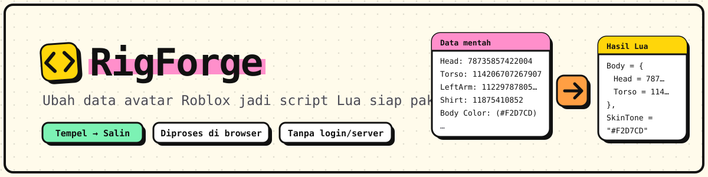

# RigForge

<p align="center">
  
</p>

**Konverter data mentah avatar Roblox menjadi script Lua untuk Roblox Studio.** Tempel data di
kiri, salin hasil Lua di kanan. Satu halaman, satu alat. Berjalan sepenuhnya di browser, tanpa
server dan tanpa login.

**Demo:** [rigforge-lemon.vercel.app](https://rigforge-lemon.vercel.app)

## Fitur

- **Satu halaman tanpa routing**: tidak ada hash URL dan tidak ada library routing.
- Dua cara input: **satu token per baris** (`Token: id1, id2`) atau tempel **blob** `AccessoryBlob Data`.
- **Parser tidak diubah**: aturan pencocokan token, `DynamicHead`, varian TShirt, dan seterusnya tetap.
- **Generator memakai template universal**: jumlah slot minimum per bagian, baris baru otomatis jika ID melebihi slot.
- **Statusbar** di bawah header: baris data, karakter hasil, status konversi (Siap / Kosong / Gagal / Memproses), deteksi bagian tubuh, dan tombol **Generate Paksa**.
- Tombol **Contoh Data**, **Salin Kode**, dan **Unduh .lua**.
- Ringkasan hasil deteksi: bagian tubuh, warna kulit, pakaian, dan aksesori.
- Mode terang/gelap lewat tombol di header, tersimpan di `localStorage`.
- Dilindungi **26 kasus snapshot** (`golden.json`) agar perilaku konversi tidak berubah diam-diam.

## Cara pakai

1. **Buka** [rigforge-lemon.vercel.app](https://rigforge-lemon.vercel.app) atau [jalankan lokal](#menjalankan-di-komputer).
2. **Tempel** data mentah di panel input, atau klik **Contoh Data** untuk mencoba.
3. **Pantau statusbar**: lihat jumlah baris data, status konversi, dan bagian tubuh yang terdeteksi.
4. Klik **Generate Paksa** jika ingin menjalankan ulang konversi.
5. **Tinjau** ringkasan deteksi di bawah panel output.
6. Klik **Salin Kode** atau **Unduh .lua**, lalu pakai di Roblox Studio.

<p align="center">
  
</p>

## Format input

| Format | Contoh | Catatan |
| ------ | ------ | ------- |
| **Token per baris** | `Token: id1, id2` | Satu token per baris, ID dipisah koma. |
| **Blob** | `AccessoryBlob Data` | Item bertipe aksesori (`Hat`, `Hair`, dst.) digabung dengan daftar token yang sama. |

Tombol **Contoh Data** memuat contoh dari `src/lib/sample.ts`.

## Template universal

Setiap bagian punya jumlah slot minimum, misalnya `Hat` 3, `Face` 7, dan `Jacket` 4. Daftar
lengkapnya ada di `LAYERED_GROUPS` dan `ACCESSORY_GROUPS` di `src/lib/converter.ts`.

<p align="center">
  
</p>

| Situasi | Perilaku |
| ------- | -------- |
| ID lebih sedikit dari slot | ID mengisi slot dari atas ke bawah, sisa slot tetap `AssetId = 0`. |
| ID melebihi jumlah slot | Baris baru ditambahkan **di bagian yang sama**. |
| Tipe aksesori tidak ada di template | Dibuatkan **bagian baru** di akhir `Accessories`. |
| ID identik dalam satu bagian | Hanya ditulis **sekali**. |
| Input tanpa ID | Menghasilkan template persis seperti yang ditentukan. |

Perilaku ini dikunci oleh tes di `src/lib/converter.test.ts` dan snapshot di
`src/lib/__fixtures__/golden.json`.

## Privasi

- Semua proses berjalan di browser. **Data yang ditempel tidak dikirim ke mana-mana.**
- Tanpa analytics dan tanpa pelacak apa pun.
- Font di-host sendiri lewat Fontsource, tanpa Google Fonts.
- `vercel.json` mengatur header keamanan saat deploy.

## Menjalankan di komputer

Butuh **Node.js 20.19** atau lebih baru.

```
npm install
npm run dev        # http://localhost:5173
npm test           # tes logika konversi
npm run build      # hasil di folder dist
npm run preview    # coba hasil build di http://localhost:4173
```

## Deploy ke Vercel

**Lewat GitHub (disarankan)**

1. Buat repository baru di GitHub, lalu push isi folder ini.
2. Buka <https://vercel.com/new> dan impor repository tersebut.
3. Vercel mendeteksi Vite otomatis (`vercel.json` sudah mengatur build dan header keamanan). Klik **Deploy**.

**Lewat Vercel CLI**

```
npx vercel          # deploy pratinjau
npx vercel --prod   # deploy produksi
```

### Domain sendiri

Tambahkan domain di **Project > Settings > Domains**. Agar canonical, Open Graph, `robots.txt`,
dan `sitemap.xml` memakai domain itu, tambahkan environment variable:

```
SITE_URL = https://domainkamu.com
```

Tanpa variable ini, build otomatis memakai URL produksi dari Vercel
(`VERCEL_PROJECT_PRODUCTION_URL`). `robots.txt` dan `sitemap.xml` dibuat saat build oleh plugin
di `vite.config.ts`.

## Tech stack

- **Vite** + **React 19** + **TypeScript**
- **CSS biasa** dengan design token, gaya neobrutalism (border tebal, hard shadow tanpa blur, aksen kuning)
- Font di-host sendiri lewat **Fontsource**
- **Vitest** untuk tes logika

## Struktur folder

```
src/
  App.tsx               Susunan halaman tunggal: Header + Converter + Footer
  components/
    Converter.tsx       Alat utama: input, output, tombol aksi, ringkasan
    Header.tsx          Nama produk + tagline + tombol tema
    Footer.tsx          Disclaimer merek dagang + catatan privasi
    Icon.tsx            Set ikon SVG sendiri
  hooks/useTheme.ts     Tema terang/gelap (tersimpan di localStorage)
  lib/
    converter.ts        Parser + generator Lua (inti)
    converter.test.ts   Tes snapshot + tes perilaku template universal
    __fixtures__/golden.json   Snapshot 26 kasus uji (input, output Lua)
    sample.ts           Data contoh (tombol "Contoh Data")
  styles/               tokens.css (warna dan font), base.css, site.css
public/                 favicon, ikon iOS, gambar Open Graph
docs/                   Gambar untuk README (banner, alur kerja, slot template)
```

## Kustomisasi

- **Jumlah slot:** `LAYERED_GROUPS` dan `ACCESSORY_GROUPS` di `src/lib/converter.ts`.
- **Warna dan font:** `src/styles/tokens.css`. Semua kotak memakai `--bw`/`--bw-lg` untuk ketebalan border dan `--shadow*` untuk hard shadow; varian terang dan gelap diatur di blok `:root` dan `[data-theme='dark']`.
- **Teks halaman:** `src/components/Converter.tsx`, `Header.tsx`, dan `Footer.tsx`.
- **Gambar pratinjau link:** ganti `public/og-image.png` (1200x630) dengan desain sendiri.

## Batasan yang diketahui

- **Nilai Scaling di Lua** (BodyType, Depth, Height, dan seterusnya) dan warna kulit bawaan (`Pastel orange`) ditulis tetap di `converter.ts` (konstanta `SCALING` dan `DEFAULT_SKIN_TONE`). Jika diubah, **perbarui `golden.json`** karena outputnya ikut berubah.
- **Hasil tetap perlu diuji** di Roblox Studio sebelum dipakai, terutama untuk data dari sumber yang berbeda-beda.
- Situs hanya satu halaman: tidak ada akun, riwayat, atau penyimpanan data di server.

## Catatan

Nama "Roblox" adalah merek dagang Roblox Corporation, dipakai hanya untuk menjelaskan fungsi alat.
Footer situs memuat pernyataan bahwa RigForge tidak berafiliasi dengan Roblox.

## Lisensi

[MIT](LICENSE)
