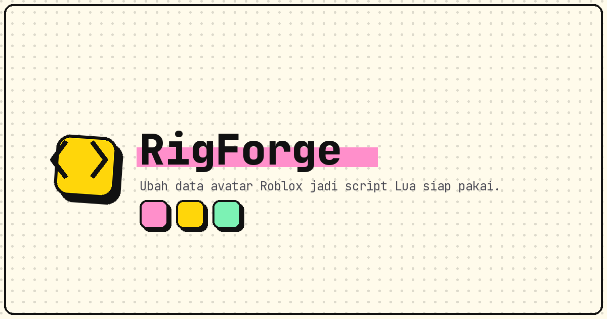

# RigForge

*Ubah data avatar Roblox jadi script Lua siap pakai.*

[](./LICENSE) [](https://rigforge-lemon.vercel.app)    

**[Demo Live](https://rigforge-lemon.vercel.app)** • **[Laporkan Bug](https://github.com/akndrn000/rigforge/issues)**

<p align="center">
  
</p>

RigForge mengubah data mentah avatar Roblox menjadi script Lua siap tempel di Roblox Studio. Ditujukan untuk pembuat game dan avatar yang ingin memindahkan tampilan avatar ke dalam script tanpa menyalin ID satu per satu. Semua proses berjalan di browser — tanpa server, tanpa login, tanpa data yang keluar dari perangkat.

## Daftar isi

- [Daftar isi](#daftar-isi)
- [✨ Fitur utama](#-fitur-utama)
- [🚀 Demo dan cara pakai](#-demo-dan-cara-pakai)
- [⚙️ Cara kerja konverter](#-cara-kerja-konverter)
- [🧰 Teknologi](#-teknologi)
- [💻 Memulai](#-memulai)
- [✅ Testing](#-testing)
- [🌐 Deploy](#-deploy)
  - [Domain sendiri](#domain-sendiri)
- [📁 Struktur proyek](#-struktur-proyek)
- [🎨 Kustomisasi](#-kustomisasi)
- [🤝 Kontribusi](#-kontribusi)
- [📄 Lisensi dan disclaimer](#-lisensi-dan-disclaimer)

## ✨ Fitur utama

- 100% client-side dan privat: konversi sinkron di browser, tidak ada request jaringan untuk data.
- Deteksi otomatis bagian tubuh (Head–Torso–lengan–kaki), warna kulit, pakaian klasik, pakaian berlapis, dan aksesori.
- Template slot universal: setiap tipe punya jumlah slot minimum, sisa slot diisi `AssetId = 0`.
- Tombol **Contoh Data** (dari `src/lib/sample.ts`), **Salin Kode**, **Unduh .lua** (`AvatarConfig.lua`), dan **Generate Paksa**.
- Status konversi langsung: Kosong / Siap / Gagal / Memproses, plus ringkasan hasil deteksi.
- Tema terang/gelap lewat tombol di header, tersimpan di `localStorage`.

## 🚀 Demo dan cara pakai

Coba langsung di <https://rigforge-lemon.vercel.app>:

1. Tempel data mentah avatar ke panel kiri (atau klik **Contoh Data**).
2. Hasil Lua tersusun otomatis di panel kanan; klik **Generate Paksa** untuk menghitung ulang.
3. Klik **Salin Kode** atau **Unduh .lua**, lalu tempel ke Roblox Studio.

Contoh input (dari `src/lib/__fixtures__/golden.json`, kasus "semua token badan + daftar + blob"):

```text
Head: 123
Torso: 456
LeftArm: 1
RightArm: 2
LeftLeg: 3
RightLeg: 4
T-Shirt: 999
Pants: 55
Shirt: 66
Body Color: 1,2,3 (#aabbcc)
Hat: 11, 12
FaceAccessory: 21, 22, 23
AccessoryBlob Data: [{"AssetId":777,"AccessoryType":"Sweater"},{"AssetId":888,"AccessoryType":"Cape"}]
```

Potongan output Lua yang dihasilkan:

```lua
Body = {
	Head = 123,
	Torso = 456,
	LeftArm = 1,
	RightArm = 2,
	LeftLeg = 3,
	RightLeg = 4,
},

SkinTone = "#AABBCC",
```

```lua
{ AssetId = 777, AccessoryType = "Sweater" },
{ AssetId = 0, AccessoryType = "Sweater" },
{ AssetId = 0, AccessoryType = "Sweater" },
```

```lua
{ AssetId = 11, AccessoryType = "Hat" },
{ AssetId = 12, AccessoryType = "Hat" },
{ AssetId = 0, AccessoryType = "Hat" },
```

```lua
{ AssetId = 888, AccessoryType = "Cape" },
```

`Cape` tidak ada di template, jadi dibuatkan bagian baru di akhir `Accessories`.

## ⚙️ Cara kerja konverter

Inti logika ada di `src/lib/converter.ts` (`convertAvatarData`).

**Aturan parser:**

- Token dibaca case-insensitive dengan format `Nama: angka`, misalnya `Head: 123`, `Hat: 11, 12`.
- `DynamicHead` diutamakan; `Head` dipakai hanya jika `DynamicHead` bernilai 0 atau tidak ada.
- `TShirt` menerima varian `TShirt`, `T-Shirt`, dan `Tshirt`.
- Warna kulit: hex dalam tanda kurung (`(#F2D7CD)`) diutamakan, lalu teks `Body Color:`, lalu bawaan `Pastel orange`.
- `AccessoryBlob Data:` berisi JSON array item `{ AssetId, AccessoryType }`; blob rusak dicatat ke console dan diabaikan.

**Aturan generator (template universal):**

- Setiap bagian punya jumlah slot minimum. ID mengisi slot dari atas ke bawah, sisa slot tetap `AssetId = 0`.
- Jika ID melebihi jumlah slot, baris baru otomatis ditambahkan di bagian yang sama.
- Tipe aksesori yang tidak ada di template dibuatkan bagian baru di akhir `Accessories`, sesuai urutan kemunculan.
- Item blob bertipe aksesori digabung dengan daftar token bertipe sama; ID identik dalam satu bagian hanya ditulis sekali.

Jumlah slot minimum per tipe:

| Bagian `Layered` | Slot | Bagian `Accessories` | Slot |
| --- | ---: | --- | ---: |
| LeftShoe | 2 | Hat | 3 |
| RightShoe | 2 | Hair | 3 |
| TShirt | 3 | Face | 7 |
| Shirt | 3 | Front | 3 |
| Pants | 3 | Neck | 3 |
| Shorts | 3 | Back | 3 |
| DressSkirt | 3 | Shoulder | 3 |
| Sweater | 3 | Waist | 3 |
| Jacket | 4 | | |

Ubah jumlah slot di `LAYERED_GROUPS` / `ACCESSORY_GROUPS` bila template perlu disesuaikan.

## 🧰 Teknologi

| Teknologi | Peran |
| --- | --- |
| Vite | Build dan dev server |
| React 19 + TypeScript | UI satu halaman (`src/App.tsx`) |
| CSS + design token (`src/styles/tokens.css`) | Styling neobrutalism (border tebal, hard shadow) |
| Fontsource (Archivo, IBM Plex Sans, JetBrains Mono) | Font yang di-host sendiri, tanpa Google Fonts |
| Vitest | Tes logika konverter |
| Vercel | Hosting demo |

## 💻 Memulai

Prasyarat: Node.js 22 (sesuai `engines` di `package.json`).

```bash
npm install     # pasang dependensi
npm run dev     # dev server di http://localhost:5173
```

Semua script `npm`:

| Perintah | Fungsi |
| --- | --- |
| `npm run dev` | Menjalankan dev server Vite |
| `npm run build` | Typecheck (`tsc --noEmit`) lalu build produksi ke `dist` |
| `npm run preview` | Mencoba hasil build di `http://localhost:4173` |
| `npm test` | Menjalankan tes sekali (`vitest run`) |
| `npm run typecheck` | Pemeriksaan tipe saja, tanpa build |

## ✅ Testing

Tes ada di `src/lib/converter.test.ts` dan memakai Vitest:

- **Tes snapshot (26 kasus)** di `src/lib/__fixtures__/golden.json`: setiap kasus berisi `input`, `lineStat`, `charStat`, dan `lua` yang diharapkan. Output `convertAvatarData` harus sama persis.
- **Tes perilaku template universal**: pengisian slot dari atas, baris tambahan saat ID melebihi slot, penggabungan token + blob, bagian baru untuk tipe tak dikenal, dan deduplikasi ID.
- **Tes ringkasan deteksi**: jumlah bagian tubuh, warna kulit, pakaian klasik/berlapis, dan aksesori dari `SAMPLE_DATA`.

```bash
npm test
```

Bila perilaku konverter sengaja diubah, perbarui entri yang relevan di `golden.json` (input dan output yang diharapkan), lalu jalankan `npm test` lagi sampai semua kasus lolos.

## 🌐 Deploy

**Lewat GitHub (disarankan):**

1. Push repo ini ke GitHub.
2. Buka <https://vercel.com/new> dan impor repository tersebut.
3. Vercel mendeteksi Vite otomatis (`vercel.json` sudah mengatur build, output `dist`, dan header keamanan). Klik **Deploy**.

**Lewat Vercel CLI:**

```bash
npx vercel          # deploy pratinjau
npx vercel --prod   # deploy produksi
```

### Domain sendiri

Tambahkan domain di **Project > Settings > Domains**, lalu atur environment variable agar canonical, Open Graph, `robots.txt`, dan `sitemap.xml` memakai domain itu:

```text
SITE_URL = https://domainkamu.com
```

Tanpa variable ini, build memakai URL produksi Vercel (`VERCEL_PROJECT_PRODUCTION_URL`), atau `http://localhost:5173` saat pengembangan lokal. `robots.txt` dan `sitemap.xml` dibuat saat build oleh plugin `siteMeta` di `vite.config.ts`.

## 📁 Struktur proyek

```text
src/
  App.tsx                 # Susunan halaman tunggal: Header + Converter + Footer
  main.tsx                # Entry point React
  components/
    Converter.tsx         # Alat utama: input, output, tombol aksi, ringkasan
    Header.tsx            # Nama produk + tagline + tombol tema
    Footer.tsx            # Disclaimer merek dagang + catatan privasi
    Icon.tsx              # Set ikon SVG sendiri
  hooks/
    useTheme.ts           # Tema terang/gelap, tersimpan di localStorage
  lib/
    converter.ts          # Parser + generator Lua (inti konverter)
    converter.test.ts     # Tes snapshot + tes perilaku template
    __fixtures__/
      golden.json         # Snapshot 26 kasus uji (input, output Lua)
    sample.ts             # Data contoh untuk tombol "Contoh Data"
  styles/
    tokens.css            # Token warna dan font (terang + gelap)
    base.css              # Gaya dasar
    site.css              # Gaya halaman dan komponen
public/
  favicon.svg             # Favicon
  apple-touch-icon.png    # Ikon iOS
  og-image.png            # Gambar pratinjau tautan (Open Graph)
vite.config.ts            # Plugin React + siteMeta (SITE_URL, robots, sitemap)
vercel.json               # Konfigurasi build dan header keamanan di Vercel
LICENSE                   # Lisensi MIT
```

## 🎨 Kustomisasi

- **Warna dan font:** `src/styles/tokens.css`. Ketebalan border (`--bw`/`--bw-strong`) dan hard shadow (`--shadow*`); varian terang dan gelap di blok `:root` dan `[data-theme='dark']`.
- **Teks halaman:** `src/components/Converter.tsx`, `Header.tsx`, `Footer.tsx`.
- **Nilai `Scaling`** (`BodyType`, `Depth`, `Height`, dst.) dan warna kulit bawaan (`Pastel orange`) ditulis tetap di `converter.ts` (konstanta `SCALING` dan `DEFAULT_SKIN_TONE`). Jika diubah, perbarui `golden.json` karena output ikut berubah.
- **Gambar pratinjau tautan** (`public/og-image.png`) bisa diganti dengan desain sendiri.

## 🤝 Kontribusi

Repo: <https://github.com/akndrn000/rigforge>. Temukan bug? Laporkan di [halaman issues](https://github.com/akndrn000/rigforge/issues).

1. Clone dan masuk ke folder proyek:

   ```bash
   git clone https://github.com/akndrn000/rigforge.git
   cd rigforge
   ```

2. Buat branch dari `main`, lalu lakukan perubahan.
3. Jalankan `npm test` dan `npm run typecheck`.
4. Buka pull request dengan penjelasan singkat tentang perubahan dan alasannya.

## 📄 Lisensi dan disclaimer

Proyek ini berlisensi MIT — lihat file [LICENSE](./LICENSE).

"Roblox" adalah merek dagang Roblox Corporation. Proyek ini alat independen dan tidak berafiliasi dengan Roblox Corporation. Situs tidak memakai analytics atau pelacak apa pun; data yang ditempel diproses di browser saja dan tidak dikirim ke mana-mana.
