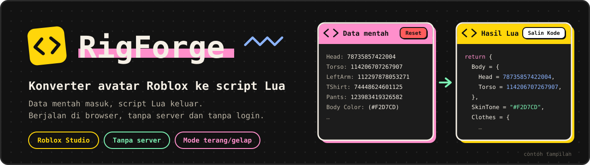
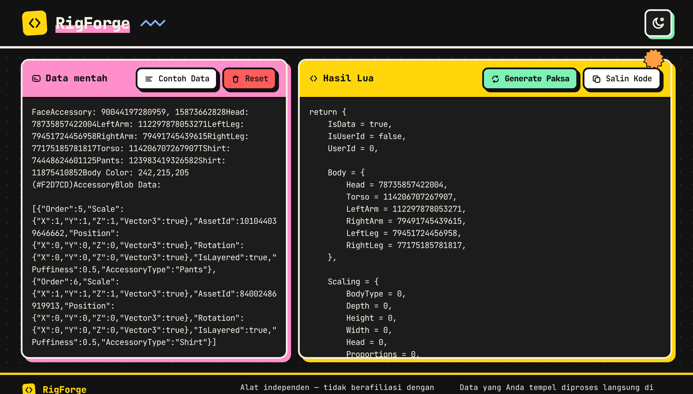
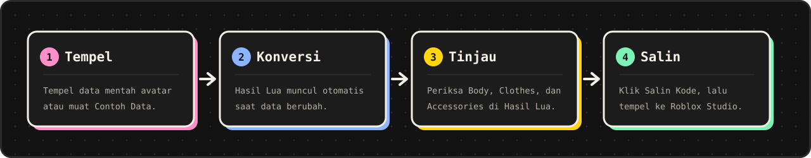
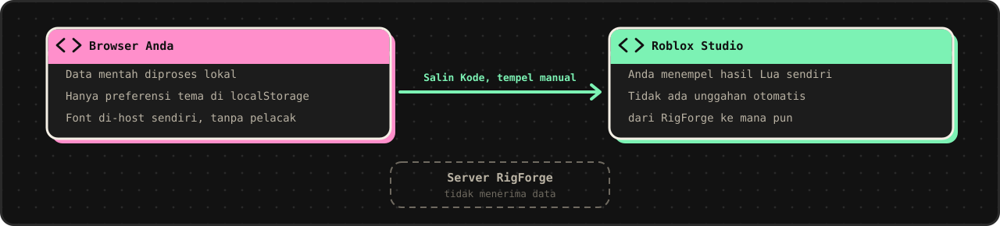

<div align="center">



<br>

[](https://rigforge-lemon.vercel.app/)


[Bahasa Indonesia](README.md) · [English](README.en.md)

**Ubah data mentah avatar Roblox menjadi script Lua yang siap ditempel ke Roblox Studio.**
Berjalan di browser Anda. Data tidak pernah dikirim ke server.

[Coba sekarang](https://rigforge-lemon.vercel.app/) ·
[Fitur](#fitur) ·
[Cara pakai](#cara-pakai) ·
[Cara kerja](#cara-kerja-konverter) ·
[Privasi](#privasi-dan-keamanan) ·
[Pengembangan](#pengembangan-lokal) ·
[Kontribusi](#kontribusi)

</div>

---

## Ringkasan

Memindahkan tampilan avatar ke dalam script berarti menyalin puluhan ID satu per satu dan menyusunnya sesuai template. RigForge membaca data mentah avatar Roblox, mengenali setiap bagiannya, lalu menyusun script Lua dengan struktur yang selalu sama.

Ada tiga hal yang menjadi pegangan alat ini:

- **Privat.** Seluruh proses berjalan di browser. Tidak ada server, tidak ada login, dan tidak ada data yang keluar dari perangkat Anda.
- **Otomatis.** Bagian tubuh, warna kulit, pakaian klasik, pakaian berlapis, dan aksesori dikenali sendiri, termasuk dari blob `AccessoryBlob Data`.
- **Konsisten.** Output memakai template slot universal dan dijaga oleh tes snapshot, sehingga hasilnya stabil dari waktu ke waktu.

## Tampilan

<table>
  <tr>
    <td width="50%" align="center"><br><sub>Mode malam</sub></td>
    <td width="50%" align="center"><br><sub>Mode siang</sub></td>
  </tr>
</table>

<sub>Pratinjau memakai tombol <b>Contoh Data</b> bawaan aplikasi.</sub>

## Fitur

| | |
|---|---|
| **100% di browser** | Konversi berjalan lokal tanpa request jaringan untuk data Anda. |
| **Deteksi otomatis** | Bagian tubuh (Head, Torso, lengan, kaki), warna kulit, pakaian klasik, pakaian berlapis, dan aksesori. |
| **Dukungan blob** | Membaca `AccessoryBlob Data` berformat JSON dan menggabungkannya dengan daftar token bertipe sama. |
| **Template slot universal** | Setiap tipe punya jumlah slot minimum. Sisa slot diisi `AssetId = 0`, dan baris baru ditambahkan bila ID melebihi slot. |
| **Hasil langsung** | Output tersusun otomatis sesaat setelah Anda menempel atau mengetik. |
| **Aksi cepat** | Tombol **Contoh Data**, **Reset**, **Generate Paksa**, dan **Salin Kode**. |
| **Pesan error jelas** | Kegagalan konversi tampil langsung di panel Hasil Lua. |
| **Mode siang dan malam** | Mengikuti sistem, bisa diganti manual. Pilihan tersimpan di browser. |
| **Tanpa pelacak** | Tidak ada analytics dan tidak ada skrip pihak ketiga. |

## Cara pakai



1. **Tempel** data mentah avatar ke panel **Data mentah**, atau klik **Contoh Data** untuk mencoba.
2. **Lihat hasilnya.** Script Lua tersusun otomatis di panel **Hasil Lua**.
3. Klik **Generate Paksa** bila Anda ingin menghitung ulang secara manual.
4. Klik **Salin Kode**, lalu **tempel** ke Roblox Studio.

> [!TIP]
> Klik **Contoh Data** terlebih dulu untuk melihat format input dan bentuk output yang diharapkan. Tombol **Reset** mengosongkan kedua panel.

<details>
<summary><b>Contoh input dan output</b></summary>

<br>

Input (dari `src/lib/__fixtures__/golden.json`, kasus "semua token badan + daftar + blob"):

```text
Head: 123
Torso: 456
LeftArm: 1
RightArm: 2
LeftLeg: 3
RightLeg: 4
T-Shirt: 999
Pants: 55
Shirt: 66
Body Color: 1,2,3 (#aabbcc)
Hat: 11, 12
FaceAccessory: 21, 22, 23
AccessoryBlob Data: [{"AssetId":777,"AccessoryType":"Sweater"},{"AssetId":888,"AccessoryType":"Cape"}]
```

Potongan output Lua:

```lua
Body = {
	Head = 123,
	Torso = 456,
	LeftArm = 1,
	RightArm = 2,
	LeftLeg = 3,
	RightLeg = 4,
},

SkinTone = "#AABBCC",
```

```lua
{ AssetId = 777, AccessoryType = "Sweater" },
{ AssetId = 0, AccessoryType = "Sweater" },
{ AssetId = 0, AccessoryType = "Sweater" },
```

```lua
{ AssetId = 11, AccessoryType = "Hat" },
{ AssetId = 12, AccessoryType = "Hat" },
{ AssetId = 0, AccessoryType = "Hat" },
```

```lua
{ AssetId = 888, AccessoryType = "Cape" },
```

`Cape` tidak ada di template, jadi dibuatkan bagian baru di akhir `Accessories`.

</details>

## Cara kerja konverter

Inti logika ada di `src/lib/converter.ts` (fungsi `convertAvatarData`).

**Aturan parser**

- Token dibaca tanpa membedakan huruf besar dan kecil, dengan format `Nama: angka`, misalnya `Head: 123` atau `Hat: 11, 12`.
- `DynamicHead` diutamakan. `Head` dipakai hanya bila `DynamicHead` bernilai 0 atau tidak ada.
- `TShirt` menerima varian `TShirt`, `T-Shirt`, dan `Tshirt`.
- Warna kulit: hex dalam tanda kurung (`(#F2D7CD)`) diutamakan, lalu teks `Body Color:`, lalu bawaan `Pastel orange`.
- `AccessoryBlob Data:` berisi JSON array item `{ AssetId, AccessoryType }`. Blob yang rusak dicatat ke console dan diabaikan.

**Aturan generator (template universal)**

- Setiap bagian punya jumlah slot minimum. ID mengisi slot dari atas ke bawah, dan sisa slot tetap `AssetId = 0`.
- Bila ID melebihi jumlah slot, baris baru otomatis ditambahkan di bagian yang sama.
- Tipe aksesori yang tidak ada di template dibuatkan bagian baru di akhir `Accessories`, sesuai urutan kemunculan.
- ID identik dalam satu bagian hanya ditulis sekali.

<details>
<summary><b>Jumlah slot minimum per tipe</b></summary>

<br>

| Bagian `Layered` | Slot | Bagian `Accessories` | Slot |
|---|---:|---|---:|
| LeftShoe | 2 | Hat | 3 |
| RightShoe | 2 | Hair | 3 |
| TShirt | 3 | Face | 7 |
| Shirt | 3 | Front | 3 |
| Pants | 3 | Neck | 3 |
| Shorts | 3 | Back | 3 |
| DressSkirt | 3 | Shoulder | 3 |
| Sweater | 3 | Waist | 3 |
| Jacket | 4 | | |

Jumlah slot diatur di `LAYERED_GROUPS` dan `ACCESSORY_GROUPS` pada `converter.ts`.

</details>

## Privasi dan keamanan



- Data yang Anda tempel diproses **langsung di browser**. Tidak ada request jaringan untuk data tersebut.
- Aplikasi tidak memakai analytics maupun pelacak.
- Satu-satunya data yang disimpan di browser adalah pilihan tema (kunci `rl-theme` di localStorage).
- Hosting di Vercel menyertakan header keamanan: `X-Content-Type-Options`, `X-Frame-Options: DENY`, `Referrer-Policy`, dan `Permissions-Policy`.

## Batasan yang diketahui

- Data input harus memakai nama token yang dikenali parser. Baris yang tidak dikenali diabaikan.
- Struktur dan jumlah slot output mengikuti template tetap. Perubahan template perlu mengubah kode dan snapshot tes.
- Nilai `Scaling` dan warna kulit bawaan ditulis tetap di `converter.ts`.
- Selalu uji script hasil di Roblox Studio Anda sebelum dipakai di proyek sungguhan.
- Alat ini bersifat independen dan **tidak berafiliasi dengan Roblox Corporation**. "Roblox" adalah merek dagang Roblox Corporation.

## Pengembangan lokal

Prasyarat: Node.js 22 (sesuai `engines` di `package.json`) dan npm.

```bash
git clone https://github.com/akndrn000/rigforge.git
cd rigforge
npm install
npm run dev        # http://localhost:5173
```

| Perintah | Fungsi |
|---|---|
| `npm run dev` | Menjalankan dev server Vite. |
| `npm run build` | Pemeriksaan tipe lalu build produksi ke `dist`. |
| `npm run preview` | Mencoba hasil build di `http://localhost:4173`. |
| `npm test` | Menjalankan semua tes sekali (Vitest). |
| `npm run typecheck` | Pemeriksaan tipe saja, tanpa build. |

Tidak ada environment variable yang dibutuhkan.

### Testing

Tes ada di `src/lib/converter.test.ts` (saat ini 74 tes), termasuk **26 kasus snapshot** di `src/lib/__fixtures__/golden.json`. Setiap kasus berisi `input`, `lineStat`, `charStat`, dan `lua` yang diharapkan, dan output `convertAvatarData` harus sama persis.

> [!NOTE]
> Bila perilaku konverter sengaja diubah, perbarui entri yang relevan di `golden.json`, lalu jalankan `npm test` lagi sampai semua kasus lolos.

### Struktur folder

```
src/
  App.tsx          susunan halaman tunggal: Header, Converter, Footer
  main.tsx         entry point React
  components/      Converter, Header, Footer, Icon
  hooks/           useTheme (tema siang/malam)
  lib/             converter.ts (parser + generator), sample.ts, tes, __fixtures__/
  styles/          tokens.css (token desain), base.css, site.css
public/            favicon, brand.svg, apple-touch-icon, og-image
docs/              DESIGN.md, export-assets.py, images/
```

### Tech stack

- **Vite**, **React 19**, dan **TypeScript**
- **CSS biasa** dengan token desain di `src/styles/tokens.css` (neobrutalism modern: blok warna, border tebal, bayangan keras)
- **JetBrains Mono** (variable) lewat Fontsource, di-host sendiri tanpa Google Fonts
- **Vitest** untuk tes logika konverter

Panduan visual ada di [`docs/DESIGN.md`](docs/DESIGN.md).

### Kustomisasi

- **Warna, font, dan geometri:** ubah `src/styles/tokens.css`. Komponen hanya memakai token, jadi tidak ada warna yang di-hardcode di CSS maupun JSX.
- **Teks halaman:** `src/components/Converter.tsx`, `Header.tsx`, dan `Footer.tsx`.
- **Nilai `Scaling` dan warna kulit bawaan:** konstanta `SCALING` dan `DEFAULT_SKIN_TONE` di `converter.ts`. Bila diubah, perbarui `golden.json` karena output ikut berubah.
- **Aset PNG** (`og-image.png`, `apple-touch-icon.png`): dirender ulang dari desain yang sama dengan `python docs/export-assets.py` (membutuhkan Pillow dan fontTools).

## Deploy ke Vercel

Hubungkan repo ini ke Vercel Dashboard, atau deploy dari terminal:

```bash
npx vercel          # pratinjau
npx vercel --prod   # produksi
```

`vercel.json` sudah mengatur framework Vite, perintah build, folder output `dist`, `cleanUrls`, header keamanan, dan cache jangka panjang untuk `/assets`. Aplikasi dilayani dari akar domain (`base: '/'` di `vite.config.ts`).

## Kontribusi

Masukan dan perbaikan sangat diterima. Baca [CONTRIBUTING.md](CONTRIBUTING.md) untuk alur kerja, standar kode, dan cara melaporkan bug. Riwayat perubahan ada di [CHANGELOG.md](CHANGELOG.md).

## Lisensi

Dirilis di bawah [Lisensi MIT](LICENSE).

---

<div align="center">
<sub>RigForge. Alat independen untuk pembuat game dan avatar Roblox. Diproses lokal di browser.</sub>
</div>
